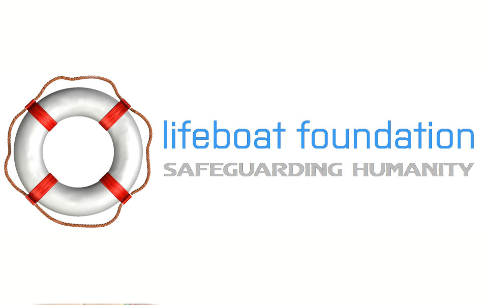
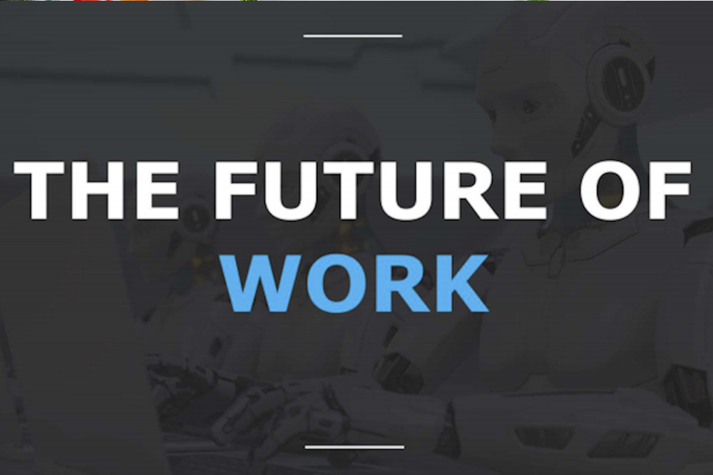

<!DOCTYPE html>
<html lang="en">
<head>
  <meta charset="utf-8">
  <title>Guido Putignano</title>
  <meta content="width=device-width, initial-scale=1.0" name="viewport">
  <meta content="" name="keywords">
  <meta content="" name="description">

  <!-- Favicons -->
  <link href="img/favicon.png" rel="icon">
  <link href="img/apple-touch-icon.png" rel="apple-touch-icon">

  <!-- Bootstrap CSS File -->
  <link href="lib/bootstrap/css/bootstrap.min.css" rel="stylesheet">

  <!-- Libraries CSS Files -->
  <link href="lib/font-awesome/css/font-awesome.min.css" rel="stylesheet">
  <link href="lib/animate/animate.min.css" rel="stylesheet">
  <link href="lib/ionicons/css/ionicons.min.css" rel="stylesheet">
  <link href="lib/owlcarousel/assets/owl.carousel.min.css" rel="stylesheet">
  <link href="lib/lightbox/css/lightbox.min.css" rel="stylesheet">

  <!-- Main Stylesheet File -->
  <link href="css/style-red.css" rel="stylesheet">

    <!-- Contact form new css -->
  <!--  <link href="contactform-nuovo/fcf-assets/css/fcf.default.css" rel="stylesheet">
    <link href="contactform-nuovo/fcf-assets/css/fcf.default-custom.css" rel="stylesheet">

  <!-- =======================================================
    Theme Name: DevFolio
    Theme URL: https://bootstrapmade.com/devfolio-bootstrap-portfolio-html-template/
    Author: BootstrapMade.com
    License: https://bootstrapmade.com/license/
  ======================================================= -->
</head>

<body id="page-top">

  <!--/ Nav Star /-->
  <nav class="navbar navbar-b navbar-trans navbar-expand-md fixed-top" id="mainNav">
    

      <a class="navbar-brand js-scroll" href="#page-top">Guido Putignano</a>
      <button class="navbar-toggler collapsed" type="button" data-toggle="collapse" data-target="#navbarDefault"
        aria-controls="navbarDefault" aria-expanded="false" aria-label="Toggle navigation">
        
        
        
      </button>
      

        <ul class="navbar-nav">
          <li class="nav-item">
            <a class="nav-link js-scroll active" href="#home">Home</a>
          </li>
          <li class="nav-item">
            <a class="nav-link js-scroll" href="#about" href="about.html">About</a>
          </li>
          <li class="nav-item">
             <!-- <a class="nav-link js-scroll" href="#work">Portfolio</a> --> 
                 <a class="nav-link js-scroll" href="portfolio.html">Portfolio</a>
          </li>
          <li class="nav-item">
           <!-- <a class="nav-link js-scroll" href="#blog">Blog</a> -->
            <a class="nav-link js-scroll" href= "#blog" href="blog.html">Blog</a>

          </li>
          <li class="nav-item">
            <a class="nav-link js-scroll" href="#contact">Contact</a>
          </li>
        </ul>
      

    

  </nav>
  <!--/ Nav End /-->

  <!--/ Intro Skew Star /-->
  

    

    

      

        

          <!--
Hello, world!
-->
          <h1 class="intro-title mb-4">I am Guido Putignano</h1>
          
Entrepreneur,Futurist,Researcher<strong class="text-slider"></strong>

          <!-- 
<a class="btn btn-primary btn js-scroll px-4" href="#about" role="button">Learn More</a>
 -->
        

      

    

  

<!--/ Intro Skew End /-->

  <section id="about" class="about-mf sect-pt4 route">
    

      

        

          

            

              

                

                  

                    

                      
                    

                  

                  

                    

                      
Name:  Guido Putignano

                      
Mission:  Enhance the Human Race.

                      
Email:  guido@example.com

                      
Phone:  +39 340 5225 8406

                    

                  

                

                

                  
Skill

                  HTML 85%
                  

                    

                  

                  CSS3 75%
                  

                    

                  

                  PHP 50%
                  

                    

                  

                  JAVASCRIPT 90%
                  

                    

                  

                

              

              

                

                  

                    <h5 class="title-left">
                      About me
                    </h5>
                  

                  

                    I am the Founder of a company focused on digital transformation using a platform that synthesises
                    data to stop data pollution thanks to AI, sensors and Gamification.
                    I am young, and I think it is an advantage because what made you succeed in the past will kill in the future.
                  

                  

                   I have worked in the Education and Healthcare sectors.Instead in the education sector, with SAFES, we have 
                   created the first master in the world to transform CO2 into valuable products to solve climate change.
                   At Openexo, the most important community in the world of Exponential Masters, we teach people about how to turn a
                   company exponential.
                  

                  

                  At Visionari, I am Head of the Artificial Intelligence Department.
                  In the Healthcare sector, I am Head Of Exponential Technologies for the Environment and Health Department at SIMA,
                  the most important organization about Environmental Medicine in Europe and I am Member Of The Board Of Advisors 
                  (Biotech/Medical Board and Futurists Board) at the Lifeboat Foundation.
                  

                

              

            

          

        

      

    

  </section>

  <!--/ Section Services End /-->

  

    

    

      

        

          

            

              <i class="ion-checkmark-round"></i>
            

            

              
450

              WORKS COMPLETED
            

          

        

        

          

            

              <i class="ion-ios-calendar-outline"></i>
            

            

              
15

              YEARS OF EXPERIENCE
            

          

        

        

          

            

              <i class="ion-ios-people"></i>
            

            

              
550

              TOTAL CLIENTS
            

          

        

        

          

            

              <i class="ion-ribbon-a"></i>
            

            

              
36

              AWARD WON
            

          

        

      

    

  

  <!--/ Section Portfolio Star /-->
  <section id="work" class="portfolio-mf sect-pt4 route">
    

      

        

          

            <h3 class="title-a">
              Portfolio
            </h3>
            

              "To enhance the human race"
            

            

          

        

      

      

        

          

            <a href="img/work-1.jpg" data-lightbox="gallery-mf">
              

                 
              

              

                

                  

                    <h2 class="w-title">The future of work</h2>
                    

                      Guido / 18 Sep. 2018
                    

                  

                  

                    

                      
                    

                  

                

              

            </a>
          

        

        

          

            <a href="img/work-2.jpg" data-lightbox="gallery-mf">
              

                
              

              

                

                  

                    <h2 class="w-title">AI Youth Council</h2>
                    

                      World Economic Forum
                    

                  

                  

                    

                      
                    

                  

                

              

            </a>
          

        

        

          

            <a href="img/work-3.jpg" data-lightbox="gallery-mf">
              

                
              

              

                

                  

                    <h2 class="w-title">Human Enhancement</h2>
                    

                      Medium / 14 Sep. 2020
                    

                  

                  

                    

                      
                    

                  

                

              

            </a>
          

        

        

          

            <a href="img/work-4.jpg" data-lightbox="gallery-mf">
              

                  
              

              

                

                  

                    <h2 class="w-title">Openexo Digitalization</h2>
                    

                      Italian Ambassador / Youtube
                    

                  

                  

                    

                      
                    

                  

                

              

            </a>
          

        

        

          

            <a href="img/work-5.jpg" data-lightbox="gallery-mf">
              

                <ahref="https://www.google.com/url?q=https://www.mci.edu/en/university/events/145-alle-veranstaltungen-de/studiengaenge/2697-mcit-forum-2020-en&sa=D&ust=1606130219007000&usg=AFQjCNHZb5_wOoj6ryYYNE68Msa-Hm_d8Q"></a>
              

              

                

                  

                    <h2 class="w-title">MCit Forum Redesigning Work</h2>
                    

                      MCIT / 10 jun. 2020
                    

                  

                  

                    

                      
                    

                  

                

              

            </a>
          

        

        

          

            <a href="img/work-6.jpg" data-lightbox="gallery-mf">
              

                
              

              

                

                  

                    <h2 class="w-title">Lifeboat Foundation Advisor</h2>
                    

                      Advisor 
                    

                  

                  

                    

                      
                    

                  

                

              

            </a>
          

        

 

          

            <a href="img/work-4 (copia).jpg" data-lightbox="gallery-mf">
              

                  
              

              

                

                  

                    <h2 class="w-title">SAFES PRO</h2>
                    

                      Vicepresident
                    

                  

                  

                    

                      
                    

                  

                

              

            </a>
          

        

        

          

            <a href="img/work-5 (copia).jpg" data-lightbox="gallery-mf">
              

                
              

              

                

                  

                    <h2 class="w-title">Head Of Exponential Technologies for the Environment and Health Department</h2>
                    

                      SIMA
                    

                  

                  

                    

                      
                    

                  

                

              

            </a>
          

        

        

          

            <a href="img/work-6 (copia).jpg" data-lightbox="gallery-mf">
              

                
              

              

                

                  

                    <h2 class="w-title">The Knowledge Society Innovator</h2>
                    

                      TKS/innovator
                    

                  

                  

                    

                      
                    

                  

                

              

            </a>
          

        

         

          

            <a href="img/work-4 (un'altra copia).jpg" data-lightbox="gallery-mf">
              

                  
              

              
            

                

                  

                    <h2 class="w-title">Head Of Artificial Intelligence Department</h2>
                    

                      Visionari
                    

                  

                  

                    

                      
                    

                  

                

              

            </a>
          

        

        

          

            <a href="img/work-5 (un'altra copia).jpg" data-lightbox="gallery-mf">
              

                
              

              

                

                  

                    <h2 class="w-title">Campus Party</h2>
                    

                      The future of work
                    

                  

                  

                    

                      
                    

                  

                

              

            </a>
          

        

       

        
      

    

  </section>
  <!--/ Section Portfolio End /-->

  <!--/ Section Testimonials Star /-->
  

    

    

      

        
          

        

      

    

  

  <!--/ Section Blog Star /-->
  <section id="blog" class="blog-mf sect-pt4 route">
    

      

        

          

            <h3 class="title-a">
              Blog
            </h3>
            

              "to enhance the human race"
            

            

          

        

      

      

        

          

            

              
            

            

              

                

                  <h6 class="category">management</h6>
                

              

              <h3 class="card-title"><a href="blog-single.html">Community&Crowd</h3>
              

                What are the guidelines for creating a successful community? In this post I tried to answer based on my experiences.
              

            

            

              

                <a href="#">
                  
                  Guido
                </a>
              

              

                 10 min
              

            

          

        

        

          

            

              
            

            

              

                

                  <h6 class="category">innovation</h6>
                

              

              <h3 class="card-title"><a href="blog-single.html">The future of work</a></h3>
              

                Have you ever wondered what are the best courses of study for work in the future? Read my article and make up your mind. 
              

            

            

              

                <a href="#">
                  
                  Guido
                </a>
              

              

                 7 min
              

            

          

        

        
      

    

  </section>
  <!--/ Section Blog End /-->

  <!--/ Section Contact-Footer Star /-->
  <section class="paralax-mf footer-paralax bg-image sect-mt4 route" style="background-image: url(img/overlay-bg.jpg)">
    

    

      

        

          

            

              

                <!-- Contact form vecchio -->
                

                  

                    <h5 class="title-left">
                      Send Message Us
                    </h5>
                  
 
                 <!-- 

                      <form action="" method="post" role="form" class="contactForm">
                      
Your message has been sent. Thank you!

                      

                      

                        

                          

                            <input type="text" name="name" class="form-control" id="name" placeholder="Your Name" data-rule="minlen:4" data-msg="Please enter at least 4 chars" />
                            

                          

                        

                        

                          

                            <input type="email" class="form-control" name="email" id="email" placeholder="Your Email" data-rule="email" data-msg="Please enter a valid email" />
                            

                          

                        

                        

                            

                              <input type="text" class="form-control" name="subject" id="subject" placeholder="Subject" data-rule="minlen:4" data-msg="Please enter at least 8 chars of subject" />
                              

                            

                        

                        

                          

                            <textarea class="form-control" name="message" rows="5" data-rule="required" data-msg="Please write something for us" placeholder="Message"></textarea>
                            

                          

                        

                        

                          <button type="submit" class="button button-a button-big button-rouded">Send Message</button>
                        

                      

                    </form>
                  

                
 -->

<!-- Contact form nuovo -->

    

        

            <form class="fcf-form-class" method="post" action="fcf-assets/fcf.process.php">

                

                    <label for="Name" class="label has-text-weight-normal">Your name</label>
                    

                        <input type="text" name="Name" id="Name" class="input is-full-width" maxlength="100"
                            data-validate-field="Name">
                    

                

                

                    <label for="Email" class="label has-text-weight-normal">Your email address</label>
                    

                        <input type="email" name="Email" id="Email" class="input is-full-width" maxlength="100"
                            data-validate-field="Email">
                    

                

                

                    <label for="Phone" class="label has-text-weight-normal">Your phone number (optional)</label>
                    

                        <input type="tel" name="Phone" id="Phone" class="input is-full-width" maxlength="30"
                            data-validate-field="Phone">
                    

                

                

                    <label for="Message" class="label has-text-weight-normal">Your message</label>
                    

                        <textarea name="Message" id="Message" class="textarea" maxlength="3000" rows="5"
                            data-validate-field="Message"></textarea>
                    

                

                

                

                    

                        <button id="fcf-button" type="submit" class="button is-link is-medium is-fullwidth">Send
                            Message</button>
                    

                

                <!-- You MUST retain the attribution below 
                
Contact Form by <a href="https://www.freecontactform.com/" class="fcf-attribution-link">FreeContactForm</a>

            </form> -->
        
 
    

       

            <!-- Thank you message goes below -->

            <strong>Thank you</strong>
            
Thanks for contacting us, we will get back in touch with you soon.
 -->
                

                  

                    <h5 class="title-left">
                      Get in Touch
                    </h5>
                  

                  

                    

                      Lorem ipsum dolor sit amet consectetur adipisicing elit. Facilis dolorum dolorem soluta quidem
                      expedita aperiam aliquid at.
                      Totam magni ipsum suscipit amet? Autem nemo esse laboriosam ratione nobis
                      mollitia inventore?
                    

                    <ul class="list-ico">
                      <li> 329 WASHINGTON ST BOSTON, MA 02108</li>
                      <li> (617) 557-0089</li>
                      <li> contact@example.com</li>
                    </ul>
                  

                  

                    <ul>
                      <li><a href=""><i class="ion-social-facebook"></i></a></li>
                      <li><a href=""><i class="ion-social-instagram"></i></a></li>
                      <li><a href=""><i class="ion-social-twitter"></i></a></li>
                      <li><a href=""><i class="ion-social-pinterest"></i></a></li>
                    </ul>
                  

                

              

            

          

        

      

    

    <footer>
      <!-- 

        

          

            

              
&copy; Copyright <strong>DevFolio</strong>. All Rights Reserved

              
 -->
                <!--
                  All the links in the footer should remain intact.
                  You can delete the links only if you purchased the pro version.
                  Licensing information: https://bootstrapmade.com/license/
                  Purchase the pro version with working PHP/AJAX contact form: https://bootstrapmade.com/buy/?theme=DevFolio
                -->
                <!-- Designed by <a href="https://bootstrapmade.com/">BootstrapMade</a> -->
            
         
    </footer>
  
  <!--/ Section Contact-footer End /-->

  <a href="#" class="back-to-top"><i class="fa fa-chevron-up"></i></a>
  

  <!-- JavaScript Libraries -->
  
  
  
  
  
  
  
  
  
  
  <!-- Contact Form JavaScript File vecchio -->
  
  <!-- Contact Form JavaScript File new -->
 
    
  <!-- Template Main Javascript File -->
  

</body>
</html>
